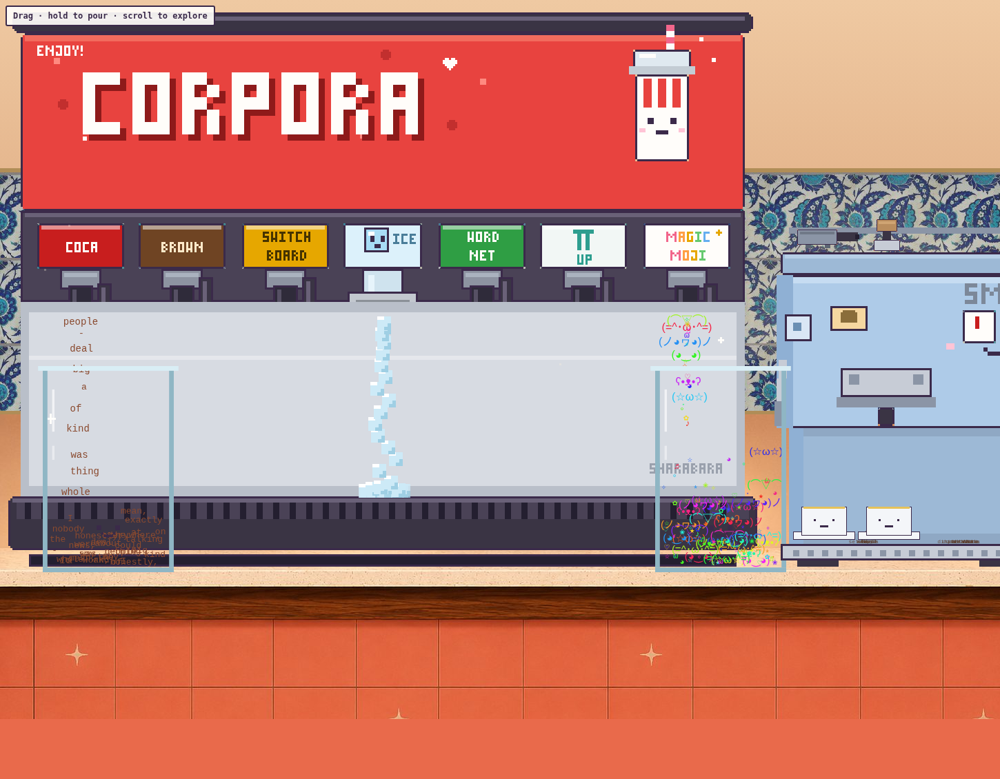
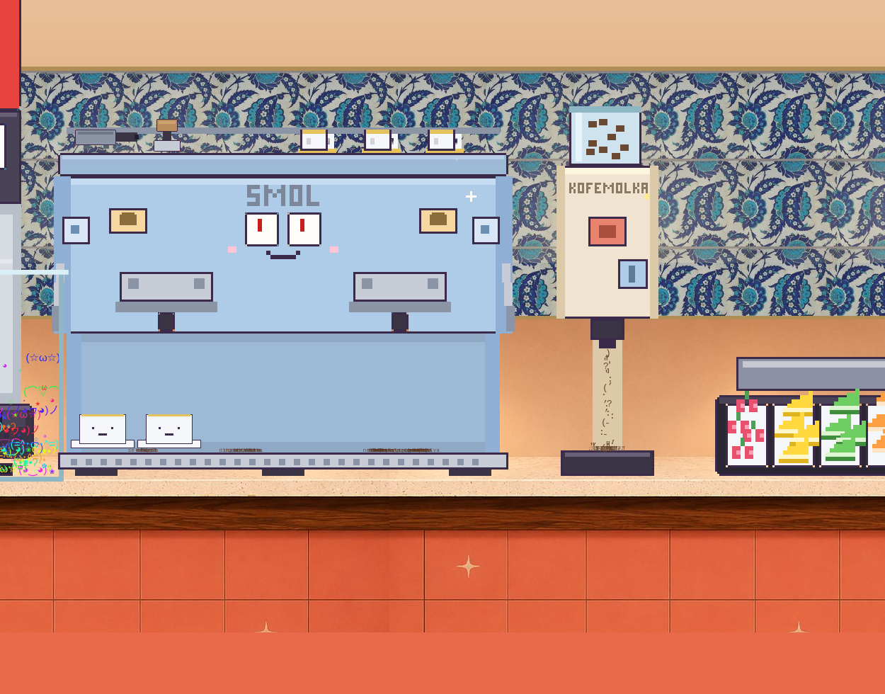
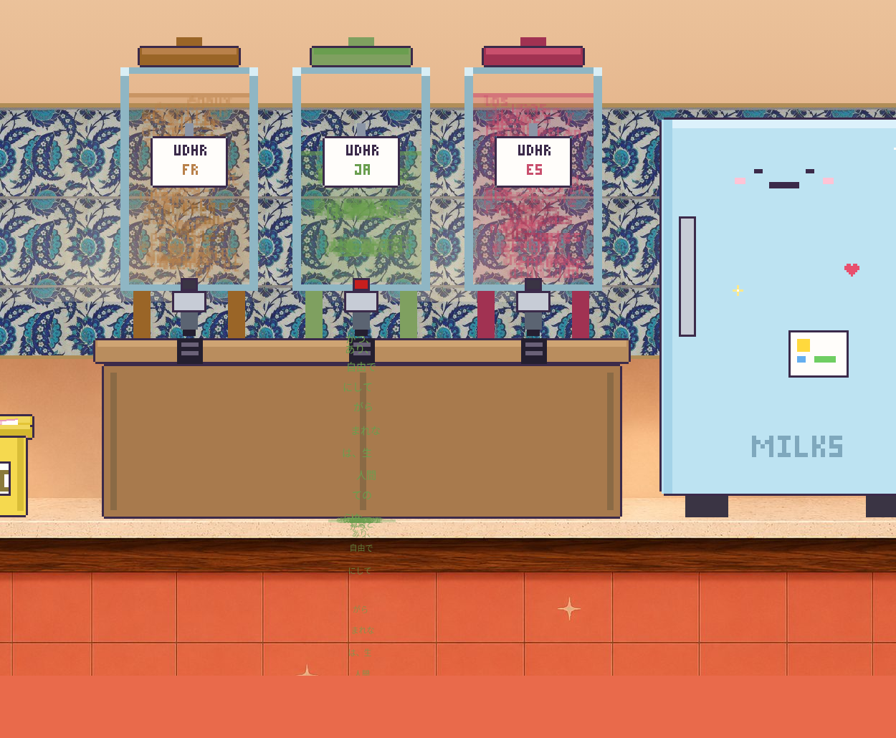
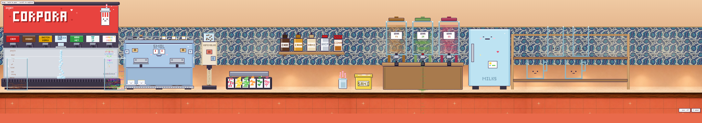

# corpora-cafe 🥤

A pixel drink counter where every tap pours a real linguistics corpus, word by word, with physics.

**[▶ Play it here](https://brezgis.github.io/corpora-cafe/)**

## What is this

A hard-pixel, early-2000s-web-style café built as one self-contained HTML file.
The soda fountain dispenses corpora. The espresso machine pulls timed shots of
Dante. The tea urns hold the Universal Declaration of Human Rights in three
languages, steeping as visible tokens. Everything you pour falls as words,
collapses into characters when it lands in a glass, and stacks into a drink
you can garnish, steam, slurp — or spill, and then mop up with the rag from
the SANI bucket.

## Quickstart

Open `index.html` in a browser. That's it — no build, no dependencies, no
network requests. (Or serve the folder with any static server.)

- **Hold a lever / button** to pour
- **Click** a syrup, shaker, or milk carton to pick it up; **press and hold**
  to pour it (it tips over); quick-click to set it down
- **Drag** cups anywhere — they fall, land, and slosh
- **Double-click** a cup with something in it to drink it
- **Press the espresso button and wait** — the pump primes, then the shot pulls
- **Grab** garnishes and straws from their trays and drop them into drinks
- Scroll sideways: the counter is long
- `♪ jazz` in the corner starts a little café trio generated live in your browser

## On tap

| Tap | Corpus |
|---|---|
| BROWN | [The Brown Corpus](https://en.wikipedia.org/wiki/Brown_Corpus) (1961), the original million-word corpus of American English |
| COCA | in the spirit of the [Corpus of Contemporary American English](https://www.english-corpora.org/coca/) |
| SWITCHBOARD | [telephone speech](https://catalog.ldc.upenn.edu/LDC97S62), uh, you know [laughter] |
| WORDNET | [Princeton WordNet](https://wordnet.princeton.edu/) glosses |
| πUP | [the digits of π](https://en.wikipedia.org/wiki/Pi) |
| MAGIC MOJI | [kaomoji](https://en.wikipedia.org/wiki/Kaomoji), rainbow-fresh (ノ◕ヮ◕)ノ*:・゚✧ |
| espresso | Dante, [Divina Commedia](https://en.wikipedia.org/wiki/Divine_Comedy) |
| teas | the [UDHR](https://www.un.org/en/about-us/universal-declaration-of-human-rights) in French, Japanese, and Spanish |
| milks | [lorem ipsum](https://en.wikipedia.org/wiki/Lorem_ipsum), one sentence per carton |
| whip | three words of [Devo](https://en.wikipedia.org/wiki/Whip_It_(Devo_song)), floats as a cap |
| KOFEMOLKA | grinds words into punctuation |

## More of the room

The backsplash is a real museum piece: [*Tile with 'Saz' Leaf Design*](https://www.metmuseum.org/art/collection/search/452854),
Iznik, ca. 1545–55, from The Met's open-access collection (public domain).

## License

[MIT](LICENSE)

---

a [sharabara](https://brezgis.github.io) production ♡
